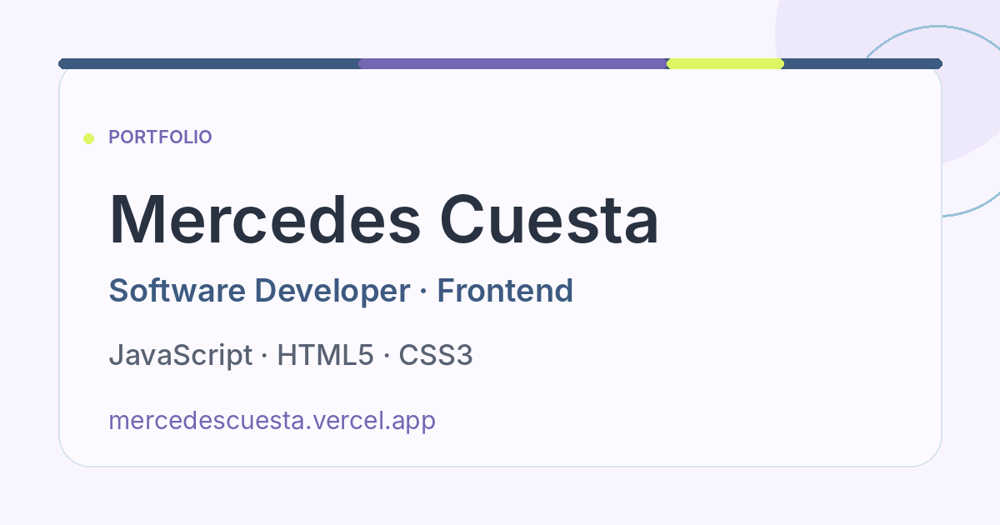

# Mercedes Cuesta · Portfolio

Portfolio personal desarrollado con HTML, CSS y JavaScript para presentar mi perfil profesional y trabajo como Frontend Developer.

[](https://mercedescuesta.vercel.app/)

## Demo

🌐 [Ver portfolio](https://mercedescuesta.vercel.app/)

## Sobre el proyecto

Portfolio responsive desarrollado desde cero como espacio personal para presentar mi perfil profesional y facilitar el acceso a mi experiencia, CV, GitHub y LinkedIn.

El proyecto está construido con tecnologías web nativas y presta especial atención a la claridad visual, el diseño responsive y la accesibilidad.

## Stack

- HTML5
- CSS3
- JavaScript

## Características

- Diseño responsive, con layout de sidebar en escritorio.
- Navegación interna por secciones.
- Sección de proyectos con enlace a la web y al repositorio de cada uno.
- Enlaces profesionales a email, LinkedIn y GitHub.
- Acceso al CV.
- Open Graph y datos estructurados (JSON-LD) para la vista previa al compartir la web.
- Barra de progreso de scroll.
- Botón para volver al inicio.
- Estados hover y focus-visible.
- Página 404 personalizada.
- Cabeceras de seguridad configuradas para Vercel.

## Accesibilidad

- Navegación mediante teclado.
- Estados focus-visible en enlaces y botones.
- Enlace "Saltar al contenido" para ir directamente al contenido principal.
- Respeto de `prefers-reduced-motion`.

## Estructura

```txt
portfolio/
├── index.html
├── cv.html
├── 404.html
├── README.md
├── THIRD_PARTY_NOTICES.md
├── robots.txt
├── sitemap.xml
├── site.webmanifest
├── vercel.json
├── .htmlvalidate.json
├── .github/
│   └── workflows/
│       └── lint.yml
├── ci/
│   ├── package.json
│   └── package-lock.json
├── css/
│   └── styles.css
├── js/
│   └── main.js
└── assets/
    ├── cv/
    │   └── mercedes-cuesta-cv-es.pdf
    ├── fonts/
    │   ├── inter-variable-latin.woff2
    │   └── LICENSE-inter.txt
    └── img/
        ├── favicon.svg
        ├── apple-touch-icon.png
        ├── icon-192.png
        ├── icon-512.png
        └── projects/
            ├── project-portfolio-og.png
            └── project-dietista-og.png
```

## Despliegue

El proyecto está desplegado en Vercel.

🌐 https://mercedescuesta.vercel.app/

## Autora

Mercedes Cuesta

- LinkedIn: https://www.linkedin.com/in/mcuestasoto
- GitHub: https://github.com/mcuestasoto
- Portfolio: https://mercedescuesta.vercel.app/

Diseñado y desarrollado por Mercedes Cuesta.

Atribuciones de terceros en [THIRD_PARTY_NOTICES.md](./THIRD_PARTY_NOTICES.md).
