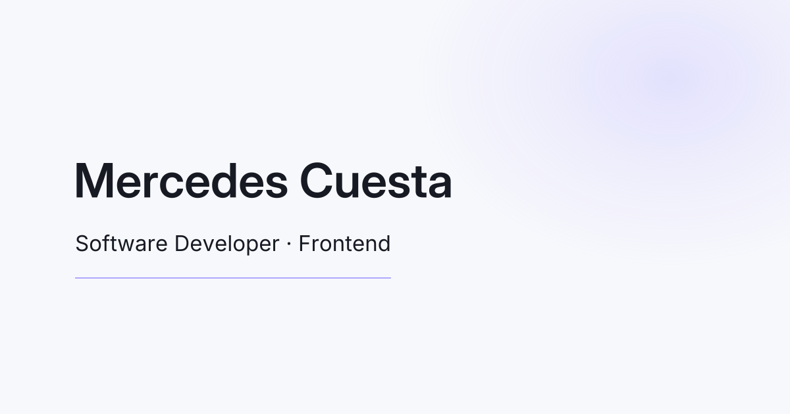

# Mercedes Cuesta · Portfolio


Portfolio personal desarrollado con HTML, CSS y JavaScript para presentar mi perfil como desarrolladora de software orientada a Frontend web, mi experiencia profesional y una selección de proyectos.

[](https://mercedescuesta.vercel.app/)

## Demo

🌐 [Ver portfolio](https://mercedescuesta.vercel.app/)

## Objetivo

El portfolio funciona como una landing profesional de lectura rápida para recruiters y hiring managers: presenta primero el posicionamiento profesional y una introducción breve, seguida de proyectos publicados, experiencia relevante, stack, formación e idiomas y vías de contacto.

Complementa el CV, LinkedIn y GitHub sin reproducirlos: prioriza evidencia verificable, navegación directa y contenido escaneable.

## Stack del proyecto

- HTML5
- CSS3
- JavaScript

Sin frameworks ni dependencias de producción. El contenido del portfolio diferencia además entre stack demostrado, herramientas y tecnologías en evolución.

## Criterios de diseño y UX

- Layout responsive con navigation rail compacta y persistente en escritorio; cambia a header superior cuando la anchura o la altura disponible dejan de ser suficientes.
- Jerarquía visual orientada a lectura rápida.
- Texto conciso y escaneable.
- Posicionamiento e introducción profesional breves en la primera pantalla; Proyectos es el primer destino de navegación y la principal evidencia Frontend.
- Experiencia en formato editorial, sin sobrecargar con cards.
- Sistema de espaciado consistente.
- Identidad visual tecnológica propia: base fría clara, tinta oscura y acento periwinkle/violeta, separada de la marca de Dietética.

## Accesibilidad

- HTML semántico.
- Navegación mediante teclado.
- Skip link.
- Estados `focus-visible`.
- Targets interactivos amplios.
- Soporte de `prefers-reduced-motion`.
- Menú móvil con gestión de foco e `inert`.
- Reflow responsive sin scroll horizontal.

## SEO y calidad técnica

- Open Graph y Twitter Card.
- Datos estructurados JSON-LD.
- Canonical, sitemap y `robots.txt`.
- Fuentes variables WOFF2 autoalojadas y precargadas.
- GitHub Actions con Prettier, html-validate y comprobación de sintaxis JavaScript.
- Cabeceras de seguridad en Vercel.
- Despliegue continuo desde `main`.

## Estructura

```txt
portfolio/
├── index.html
├── cv.html
├── 404.html
├── README.md
├── THIRD_PARTY_NOTICES.md
├── robots.txt
├── sitemap.xml
├── vercel.json
├── .htmlvalidate.json
├── .github/workflows/lint.yml
├── ci/
├── css/styles.css
├── js/main.js
└── assets/
    ├── cv/mercedes-cuesta-cv-es.pdf
    ├── fonts/
    └── img/
```

## Autora

Mercedes Cuesta

- [LinkedIn](https://www.linkedin.com/in/mcuestasoto)
- [GitHub](https://github.com/mcuestasoto)
- [Portfolio](https://mercedescuesta.vercel.app/)

Diseñado y desarrollado por Mercedes Cuesta.

Atribuciones de terceros en [THIRD_PARTY_NOTICES.md](./THIRD_PARTY_NOTICES.md).
